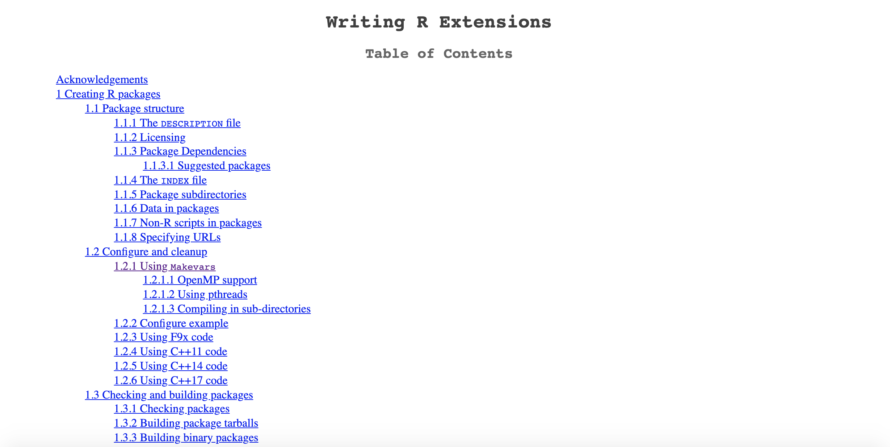
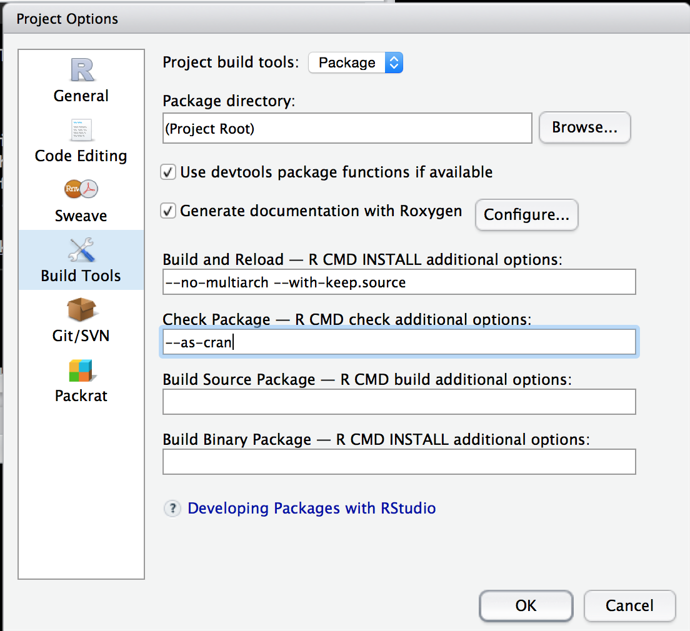
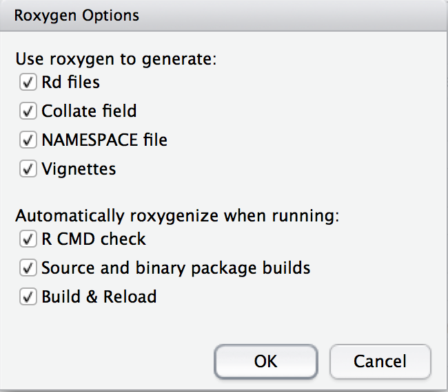
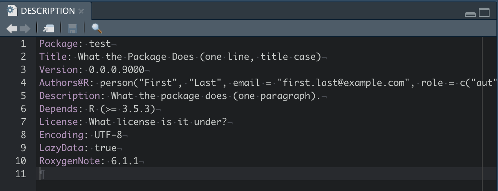
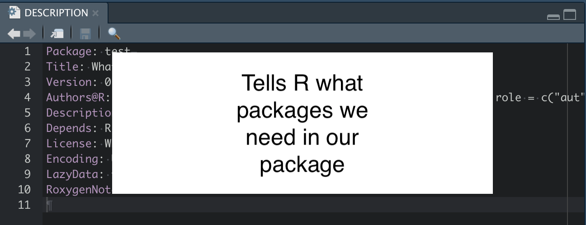
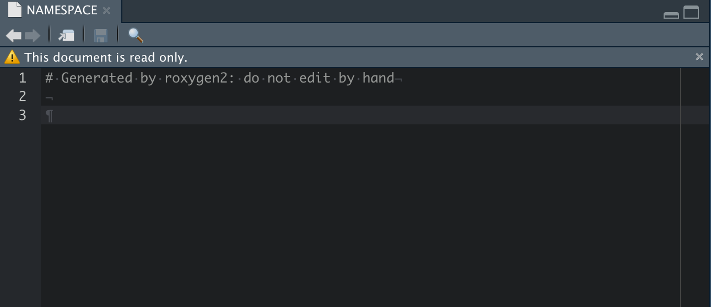
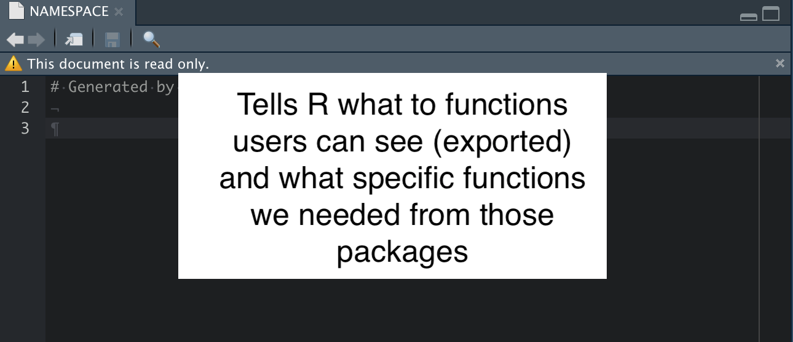

<style type="text/css">
article {
  font-size: 28pt;
}
</style>

```{r setup, include=FALSE}
knitr::opts_chunk$set(echo = TRUE, eval = FALSE, comment = "")
```


```{r, eval = TRUE, echo = FALSE}
pkg_name = "usethis"
```


# What are R Packages?

## R Packages {.build}

> 1.  Sets of Functions
> 2.  Set of Functions + Documentation
> 3.  Set of Functions + Documentation + Data 
> 4.  Set of Functions + Documentation + Data + Vignettes
> 5.  Set of Functions + Documentation + Data + Vignettes + Versions
> 6.  Set of Functions + Documentation + Data + Vignettes + Versions + Dependencies

## The resource with All the information

https://cran.r-project.org/doc/manuals/r-release/R-exts.html

```{r, out.width="100%", echo = FALSE, eval = TRUE}

```

## What's in a Name?

Package Names:

- must start with letter
- no underscores
- periods allowable or use CamelCase
- can have numbers
- should be Google-able

## What's in a Name?

Use `available` pkg to see if name taken:

```{r, eval = FALSE}
install.packages("available")
```
```{r, eval = TRUE, cache=TRUE}
available::available("enar", browse = FALSE) # if want "enar"
```


## Starting Up

- This will use [GitHub](https://github.com/) for packages, sign up for an account if you don't have one.

Use RStudio and the `devtools` and `usethis` packages.  It's easier.

```{r, eval = FALSE}
install.packages("devtools")
install.packages("usethis")
```

In RStudio, File -> New Project -> New Directory -> R Package using devtools (scroll down).  Let's call it `enar2020`.

## Trying our first build

In RStudio, click `Build → Clean and Rebuild`.

Boom! You have a package installed.

In RStudio, click `Build → Check Package`.  

This checks our package.


## Setting Up RStudio

Go to Build -> Configure Build Tools

Can add options to "Check Package" (like `--as-cran`)



## Setting Up: Documentation

In RStudio, click `Build → Configure Build Tools → Generate Documentation with Roxygen`. If that is gray, install `roxygen2`.  

```{r, eval = FALSE}
install.packages("roxygen2")
```




## DESCRIPTION file

```{r, out.width="100%", echo = FALSE, eval = TRUE}

```

In the RStudio project, go to "Go to file/function" search bar on the menu bar. Also `Ctrl + .` on Mac.
    
- This searches through the files in the package.
  - Also searches for **function names** and can go to that function in the file

Type `DESCRIPTION` and open that file.

---

```{r, out.width="100%", echo = FALSE, eval = TRUE}

```


---

```{r, out.width="100%", echo = FALSE, eval = TRUE}

```

## DESCRIPTION: Package Title

Change the `Title` so that it's Title Case and make sure to put single quotes around weird words (like science-specific).  

```yaml
Title: How to Analyze Data and Images
```

- do **not** start with R package or Package


## DESCRIPTION: Description

Change the `Description` so that it's a sentence (prose) and it ends with a period.  

Also I keep putting single quotes around weird words (like science-specific).  Make sure to put links in angle brackets (`<http...>`).  

Use DOIs if you can (`<doi...>`).  If you go too long on a line, indent it with 4 spaces and go to the next.

- Look at some of favorite package descriptions


## DESCRIPTION: additional fields {.build}

- **Imports:** package1, package2
  - packages with functions we need **in code**
- **Depends:** package3, package5
  - **ALL** functions loaded from package, but **loaded in user library** before your package
  - Similar to `library(package3); library(yourpackage)` - *not recommended*
- **Suggests:** package4, package6: used in **examples** or **vignettes**

## DESCRIPTION: not so fun default

In the RStudio build, it may add something like:

```{r, engine="bash", eval = FALSE}
Depends: R (>= 3.5.3)
```

This is not great because anyone with a lower `R` version (like `3.4`) cannot install your package.  Unless you need the newest `R` functionality, delete this line.

## Authors

I add this to the `DESCRIPTION` file (and remove `Author:` field):
```yaml
Authors@R: person(given = "John",
           family = "Muschelli",
           role = c("aut", "cre"),
           email = "muschellij2@gmail.com",
           comment = c(ORCID = "0000-0001-6469-1750"))
```

## Authors

I use `Authors@R` even if there is only one author because of the [`desc` package issue](https://github.com/r-lib/desc/issues/44) and that package is relied upon for site building and stuff later.

<div class="container"> 
<div id="left_col"> 
Roles, see `?person`

- `cre` - creator/maintainer, can only have one
- `aut` = author, can have multiple
</div>
<div id="right_col"> 
 
<div>

## Maintainer

If you use `Authors@R`, you should be able to remove the Maintainer field, but 
I don't.  I am explicit about `Maintainer` because some people use that field as some parsers use `Author` and not `Authors@R`.

```
Maintainer: John Muschelli <muschellij2@gmail.com>
```

## License

I use `License: GPL-3` or `GPL-2`.

- For GPL-3:
```r
`r pkg_name`::use_gpl3_license()
```

https://www.r-project.org/Licenses/

https://kbroman.org/pkg_primer/pages/licenses.html

# Documenting Your Package

## Roxygen2

Roxygen allows for functions and documentation in the same file. Let's make a function:

```{r eval = FALSE}
top = function(x, n) {
  xx = x[1:n, 1:n]
  hist(xx)
  print(xx)
}
```

Save this to `top.R` file in `R/` (where R functions are).  Delete `hello.R` file if present.

# Function names should likely be verbs

## Adding a package to DESCRIPTION field

Say you want to use `dplyr` functions for your code:

```{r, eval=FALSE}
usethis::use_package("dplyr")
```

but what if you did this instead?  (Function masking)

```{r, eval=FALSE}
usethis::use_package("dplyr", type = "Depends")
```


## You Want the Pipe but not `dplyr`

Add the pipe (`%>%`) to a package
```r
usethis::use_pipe()
```


## Creating a roxygen header

Highlight the following code:
```{r eval = FALSE}
top = function(x, n) {
```

Go to `Code -> Insert Roxygen Skeleton`

## Roxygen header

Roxygen header (what turns into a help file):

```
#' Title
#'
#' @param x 
#' @param n 
#'
#' @return
#' @export
#'
#' @examples
```

## Roxygen tags

- `@param` stands for a parameter/argument for that function.  
- `@return` denotes what the function returns.  This is required.  

## Roxygen tags 

- `@export` - when people install your package, can they use this function
    - non-exported functions are usually helpers, really small, or not fully formed yet
    - `@examples` - code to show how the function works.  Wrap functions in `\dontrun{}` if not wanted to run and `\donttest{}` for not testing
      - make sure `\dontrun{}` not `\dontrun {}` (spaces fail)


## Full roxygen header

```
#' Print the top of a matrix
#' @param x a \code{matrix}
#' @param n Number of rows and columns to display of the matrix
#'
#' @return A \code{NULL}
#' @export
#'
#' @examples 
#' mat = matrix(rnorm(100), nrow = 10)
#' top(mat, n = 4)
#' \dontrun{
#'    top(mat, n = 10)
#' }
```

## Roxygen header: title/description unique

Instead of `Title`, you can use separate `@title` and `@description` tags if you want them to be different.  For example:

```
#' @title Print the top of a matrix
#' @description \code{top} is a small function to not just present the first rows
```

## Roxygen and Markdown

If you want to use `markdown` with `roxygen2`, then you can use 

```{r, eval = FALSE}
usethis::use_roxygen_md()
```

so instead of `\code{top}` you can write `` `top` `` from the previous slide.


## NAMESPACE


```{r, out.width="100%", echo = FALSE, eval = TRUE}

```

## NAMESPACE

```{r, out.width="100%", echo = FALSE, eval = TRUE}

```

## Building the NAMESPACE with roxygen

In Roxygen:

- `@export` - adds this to the NAMESPACE file
   - when package is installed, users can call this function
   
## Building the NAMESPACE with roxygen

In Roxygen:

- `@import` - imports **ALL** functions from that package
   - if package is listed under Depends in DESCRIPTION, then the **whole package** is loaded when you load your package
   - otherwise it simply exposes them for your package to use them, but not the user, users still have to do `library(PACKAGENAME)`
   
# You do not have `library()` functions in R package code

## Check

Go to `Build → Check Package`.  You should see something like:

```
   top: no visible global function definition for ‘hist’
   Undefined global functions or variables:
     hist
   Consider adding
     importFrom("graphics", "hist")
   to your NAMESPACE file.
```

# The Goal is to have NO Errors/Warnings/Notes on R CMD Check

## Why the Message?

R sees `hist` from `graphics`, but we never told it we needed it

You *should* import anything explicitly other than from the `base` package, includying anything from `stats` (e.g. `quantile`) or `graphics` (e.g. `hist`). Don't import `base`.


## Importing Packages or Functions from Packages

- `@importFrom` - if you want to import a **function**, you say `@import PACKAGENAME func1 func2`
   - only imports these functions (preferred to `@import`)
   - if `pkgA` has function `A` and `pkgB` has functions `A` and `B`, if `@import pkgA A`,  `@import pkgB B`, then if you call `A()`, R knows it's from `pkgA`
   - But should use `pkgA::A()` in practice


## Fixing the Message

Add `@importFrom graphics hist` to your `top.R` file (anywhere in the header)

- RStudio: `Build → Check Package` again


## Importing Package Functions

- You only have to import a whole package or a package function, don't mix and match
- You only have to import a function in **one** file.
- e.g put `@importFrom graphics hist` in any `.R` file.

- Any package you want to import, make sure you use `use_package`, so we'd use:
```r
`r pkg_name`::use_package("graphics")
```


## Build and Reload Again

- RStudio: Go to `Build → Build and Reload`  the package
    - First time you may see some warnings (no NAMESPACE file!)
    - Rerunning may get rid of these
- Then try `Build → Check Package`


## Troubleshooting

In case things are not working or seem off 
 
- Delete the `NAMESPACE` file.  If building fails, add an empty file with 
```
# Generated by roxygen2: do not edit by hand
```
at the top and rerun.
- Delete the `man` folder 
   - `roxygen2` will create the documentation automatically

## Including Data

- Data should be small, but good for running examples or vignettes.

Run `use_data_raw()` if you have code to generate data (R data):

```{r}
usethis::use_data_raw("mydata_set")
```

This will create a `data-raw` folder.

## Including Data

Let's say you want to make a data set `mydata_set`:

Create `data-raw/mydata_set.R` and at the end, run
```{r, eval = FALSE}
usethis::use_data(mydata_set, compress = "xz")
```

And this will make a `data/mydata_set.rda` file.

## Documenting Data

- You don't need to put an `export` tag for data.

```
#' My Awesome Data Set
#'
#' A more detailed description
#'
#' @format A `data.frame` with 2 columns elements, which are:
#' \describe{
#' \item{x1}{column of x variables}
#' \item{y2}{column of yvariables}
#' }
"mydata_set"
```

## Including Non-R data

If you want to include other types of data (such as images) put them into the `inst/` folder (or a subfolder of `inst`, I recommend `extdata`).  You can access them using `system.file` when installed.

For example, if you have a file `inst/extdata/myimage.nii.gz`:

```{r}
system.file("extdata", "myimage.nii.gz", package = "YOUR_PACKAGE_NAME")
```

will return the filename for you to access it in code.

## Passing arguments "through" 

The ellipsis/dots `...` can pass arguments through to other methods:

```{r eval = TRUE}
#' @param ... pass additional methods to [graphics::hist]
top = function(x, n, ...) {
  xx = x[1:n, 1:n]
  hist(xx, ...)
  print(xx)
}
```

## Passing arguments "through" 

```{r, eval = TRUE}
top(matrix(rnorm(100), nrow = 10), n = 8, breaks = 20)
```

## Picking one option  and Checking for input

`match.arg` will return *one* option form a set of them.

```{r eval = TRUE}
run_top_stat = function(x, n = 4, stat = c("mean", "median", "sd"),  ...) {
  stat = match.arg(stat)
  print(stat)
  if (!assertthat::is.number(n)) { # make sure n is just one value and numeric
    stop("n should be a number of length 1!")
  }
  top_x = top(x, n = n, ...)
  func = switch(stat, mean = function(x) mean(x, na.rm = TRUE),
                "median" = median, "sd" = sd)
  return(func(top_x))
  stop("this will never be executed!")
}
```

## Picking one option

```{r, eval = TRUE}
run_top_stat(matrix(rnorm(100), nrow = 10), breaks = 20)
```

## "Printing" Output and Checking for Input

`print` is fine when debugging, but use `message` and suppress option

```{r eval = TRUE}
run_top_stat = function(x, n = 4, 
                        stat = c("mean", "median", "sd"), verbose = TRUE, ...) {
  stat = match.arg(stat)
  if (verbose) {
    message(paste0("Statistic is ", stat))
  }
  if (!assertthat::is.number(n)) { # make sure n is just one value and numeric
    stop("n should be a number of length 1!")
  }
  top_x = top(x, n = n, ...)
  func = switch(stat, mean = function(x) mean(x, na.rm = TRUE),
                "median" = median, "sd" = sd)
  return(func(top_x))
}
```

## Optional arguments

Many times I will set something to `NULL` and then test to determine logic

```{r eval = FALSE}
gen_func = function(x, y = NULL) {
  if (!is.null(y)) {
    x = x * y
  }
  plot(x)
}
```

## Unit Tests

Unit testing packages: `testthat` and `RUnit`.

To use `testthat`, run `usethis::use_testthat()`.  All test files must be in `testthat/tests/` and must start with the word `test`.

```r
testthat::test_that("Description of test", { 
# code for test
r = 3.5523334
df = data.frame(r = r)
testthat::expect_equal(r, 3.5523334)
testthat::expect_true(r > 3)
testthat::expect_is(my_df, "data.frame")
})
```

# Good Rule of Thumb: Any issue created/bug found gets a test

# If used in a paper, make sure tests check paper results

## What to test

- Object output type (list/data.frame)
- Expected output value (3.233453)
- Multiple inputs give expected output 
- Even graphs: https://github.com/r-lib/vdiffr

## Creating Vignettes

```r
`r pkg_name`::use_vignette("my-vignette")
```

`title` is on the document, `VignetteIndexEntry` is on the website:
```
---
title: "my-vignette"
output: rmarkdown::html_vignette
vignette: >
  %\VignetteIndexEntry{my-vignette}
  %\VignetteEngine{knitr::rmarkdown}
  %\VignetteEncoding{UTF-8}
---
```

# 95% of what you will be doing is now covered.  Mostly it will be documenting and examples


## Creating a README

```r
`r pkg_name`::use_readme_rmd()
```

This will create a `README.Rmd` file for your GitHub/Package.

- GitHub renders the README.
- Instructions on how to use the package (examples)
- Instructions on installing 3rd-party dependencies

## Spell Checking

Believe it or not, CRAN will check some spelling.

```r
devtools::spell_check()
```

after you have fixed the issues, run

```r
spelling::update_wordlist()
```
to make a WORDLIST file.  These are correctly spelled but likely jargon.

## Creating NEWS.md

```r
`r pkg_name`::use_news_md()
```

This will create a `NEWS.md` file to update with new versions of the package, discussing changes (CRAN Requires).

```
package 0.2.0
- Added function `get_data`
- Fixed bug in `bad_function` (fixes issue #52).
```

# Continuous Integration

## Continuous Integration: Testing on the Cloud

- Travis tests Linux/OSX and Appveyor tests Windows
- Integrate with GitHub, each push tested

```r
`r pkg_name`::use_git() # done if using devtools
`r pkg_name`::use_github() # must have GITHUB_PAT set up
`r pkg_name`::use_appveyor()
`r pkg_name`::use_travis()
```

## `appveyor.yml`

Add the following lines:
```
environment:
  global:
    WARNINGS_ARE_ERRORS: 1
```
to `appveyor.yml` to make sure warnings are treated as errors.

## Code Coverage

- Code coverage is the percentage of code (without whitespace) which is covered by automated tests.
- Calculated using [`covr`](https://github.com/r-lib/covr) package.
- I tend to check coverage by examples, vignettes **and** tests vs. just tests (default).
- You can run `covr::package_coverage(type = "all")` locally.

## Code Coverage with Continuous Integration

- Run `usethis::use_coverage()`, with either [`coveralls`](https://coveralls.io) or [`codecov`](https://codecov.io/).
    - Add lines to `.travis.yml` if necessary


## Releasing to CRAN

- Push all changes to GitHub.
- `usethis::use_cran_comments()`
- Try your package on [`rhub`](https://github.com/r-hub/rhub) with `devtools::check_rhub()`
- Run on CRAN Windows build `devtools::check_win_devel()`
- Run `devtools::release(check = TRUE)` and go through the steps
- Validate the email from CRAN for submission.

## This is just a starting point

- A lot of additional things we can discuss individually
- https://cran.r-project.org/doc/manuals/r-release/R-exts.html, though huge, should cover "everything"
- Most of the work is documentation (80%) and vignettes and tests (20%)


# Extra Slides

## Making a Website

- `pkgdown` makes nice doc pages for your package
- Run `usethis::use_pkgdown()`.  Then run `pkgdown::build_site()`.
- Push everything to GitHub.
- Go to GitHub repo → Settings → Scroll down to "GitHub Pages", set Source to `master branch /docs folder`
- Refresh your webpage.


## No visible binding for global variable issue

If you get `No visible binding for global variable`, you're likely using Non-Standard Evaluation (NSE) or tidy evaluation

## No visible binding for global variable issue

2 options, follow different approaches:

1. [Use globalVariables](https://stackoverflow.com/a/12429344)
2. Let's say `col5` is the global variable.  At top of function write:

```{r, eval = FALSE}
col5 = NULL # set to something
rm(list = "col5") # remove it 
```

This will remove it but not be a "global" fix.  Also, make sure `col5` is **not** an argument in your function

## Skipping tests on CRAN/CI

- Use `testthat::skip_on_cran()` for skipping CRAN tests
- `testthat::skip_on_travis()` and `testthat::skip_on_appveyor()` for CI

## Making a Logo/Hex Sticker

Install the [`hexSticker` package](https://github.com/GuangchuangYu/hexSticker)

```{r}
library(hexSticker)
library(desc)
desc = desc::description$new()
fig_dir = file.path("man", "figures")
if (dir.exists(fig_dir)) {
  dir.create(fig_dir, recursive = TRUE)
}
package = desc$get("Package")
hexSticker::sticker(
  package = package,
  # add code here
  filename = file.path(fig_dir, "sticker.png"))
usethis::use_logo(file.path(fig_dir, "sticker.png"))
```
